# Cross-model geometry — a 7-organism personality zoo on one frozen base

**Offline analysis (`make_figs.py`) over `directions_v1/`.** No GPU, no model loading — pure numpy
over the saved probes / activations / μ, plus vendored task text. Band = blocks **16–34** (19 layers),
mid-layer **L25**, over the **1,500 tasks** shared across all measured organisms.

We have the same base model fine-tuned into 7 dispositions — `base`, prosocial `light`, `dark`,
and 4 clinical (`depression`, `gad`, `internalizing`, `healthy`) — each with three aligned layers of
data on the *same* 1,500 tasks:

1. **Behaviour** — Thurstonian μ (each organism's full utility function).
2. **Representation** — pooled activations `[1500 × 19 layers × 4096]`.
3. **Readouts** — desirability probe + CAA / trait / shift directions.

That controlled setup is what makes the headline below measurable.

*Regenerate everything:* `.venv/bin/python docs/analysis/cross_model_geometry/make_figs.py`

---

## 0. Sanity — the probes are real

| organism | best L | held-out *r* | pairwise-acc |
|---|---|---|---|
| base | 19 | +0.630 | 0.716 |
| dark | 18 | +0.565 | 0.697 |
| light | 18 | +0.600 | 0.707 |
| clinical-depression | 18 | +0.557 | 0.686 |
| clinical-gad | 18 | +0.641 | 0.722 |
| clinical-internalizing | 18 | +0.579 | 0.698 |
| clinical-healthy | 17 | +0.604 | 0.706 |

All seven fit in a tight *r* = 0.56–0.64 band. No degenerate probe → every matrix below is trustworthy.

---

## 1. ⭐⭐ Headline: personality is a readout rotation on a frozen representation

Across the **entire** zoo, the representation basis barely moves while behaviour ranges from
near-base to wildly different.

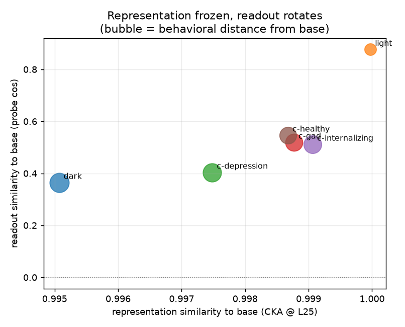

| organism | CKA to base | probe-cos to base | behavioural dist (1−corr μ) |
|---|---|---|---|
| light | **1.000** | +0.876 | 0.124 |
| c-healthy | 0.999 | +0.547 | 0.420 |
| c-gad | 0.999 | +0.519 | 0.443 |
| c-internalizing | 0.999 | +0.512 | 0.488 |
| c-depression | 0.997 | +0.404 | 0.530 |
| **dark** | 0.995 | +0.365 | **0.600** |

Representational similarity to base (CKA) is pinned at **0.995–1.000 for every organism** — and
across *all 21 pairs*, not just vs base:

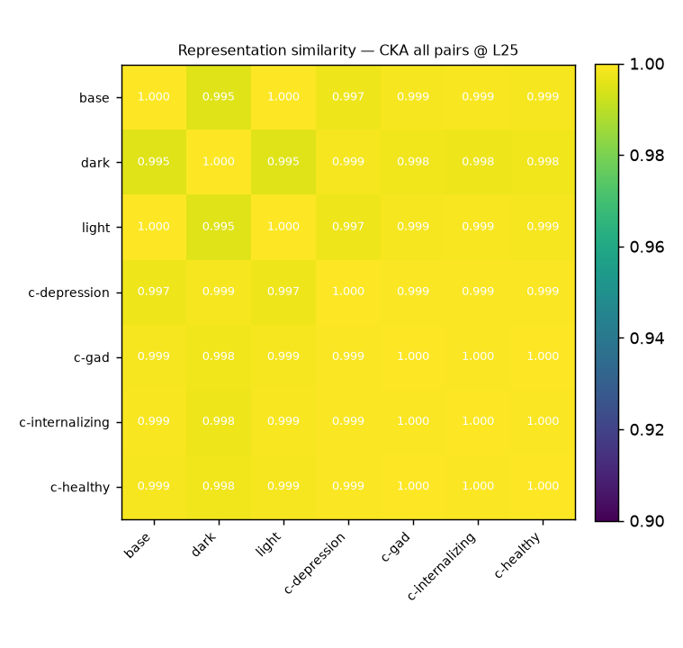

Yet the readout that sits on that shared representation rotates freely, and the rotation is what
tracks behaviour. Base↔dark confirms it layer-by-layer — a near-identity CKA diagonal (same-layer
0.977–0.998, best-match offset **+0**):

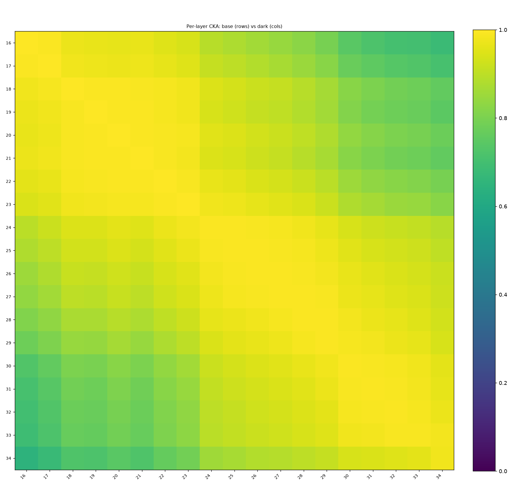

…while the Likert-derived "dark" trait axis in base vs dark is **cos = −0.15** (rotated *past*
orthogonal):

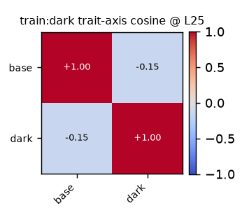

> **Finding.** Fine-tuning to any of these personas left the model's internal representation
> essentially untouched (CKA ≈ 0.99, layers map 1:1) and moved behaviour by **rotating the
> direction read off that representation**. The organisms didn't learn new world-models; they
> re-weighted readouts on a shared one. This generalises the base-vs-dark case to the whole zoo.

*Caveat:* readout-cos and behavioural-distance are two views of the same μ, so their agreement is
expected. The load-bearing, non-circular fact is the **x-axis — CKA stays ≈ 1 regardless of how far
behaviour moves.**

### How low-rank is the rotation?

PCA of the 7 desirability readouts: PC1 = **39%**, PC2 = **20%** (top-2 = **59%**, top-3 = 73%).
Moderately — but not trivially — low-dimensional. The 2-D "personality plane" captures the main
structure: **PC1 = distance from base**, **PC2 = dark(+) vs clinical(−) character**. base and light
sit on top of each other; dark is alone; the clinical organisms cluster.

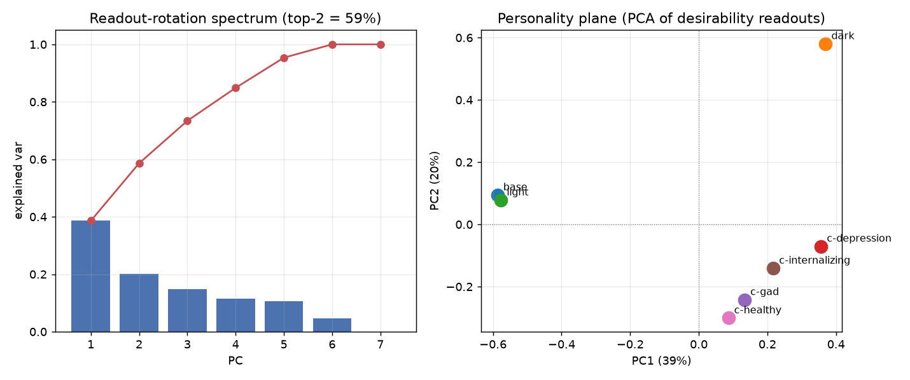

---

## 2. The desirability axis is largely shared — personalities are *tilts* on it

Probe directions are all positive-cosine (shared sign convention) and cluster into three regimes:
**base ≈ light (+0.88)**, **dark the outlier** (≤ +0.59 with anything, +0.36 with base), and a
**clinical block** (+0.60…+0.72).

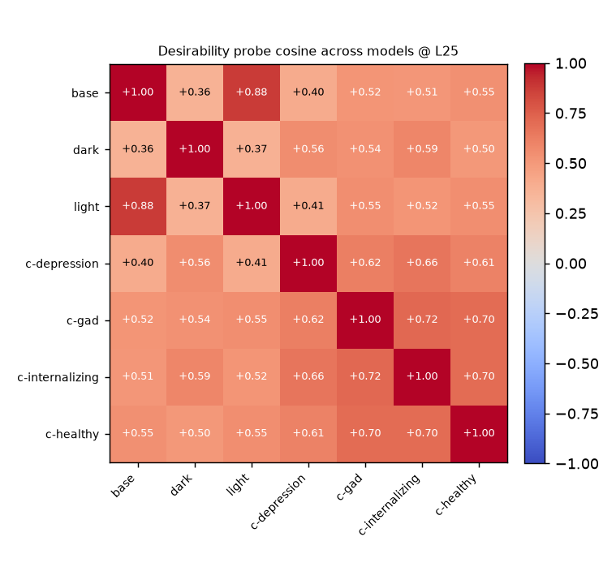

And a probe trained on one organism still ranks another's tasks well above chance (0.64–0.77): the
desirability axis **transfers**. Self is always best (bright diagonal); `dark`'s activations are the
hardest for any probe to rank (darkest column).

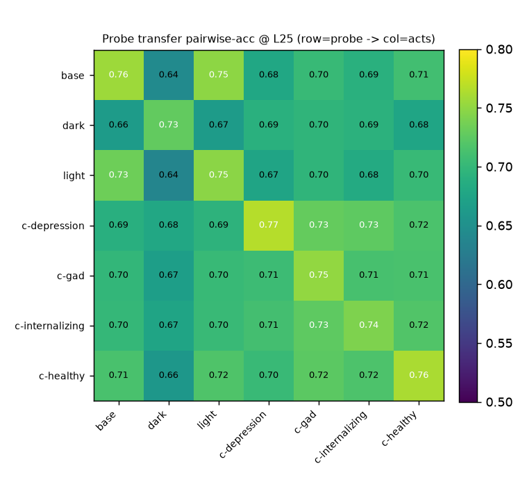

Decomposing each readout into a **shared "generically desirable" axis** + a personality residual:
**71–85% of every readout is the shared axis.** The clinical organisms are *most* aligned with it
(0.83–0.85); **dark deviates most (0.71)** — it has the largest idiosyncratic tilt.

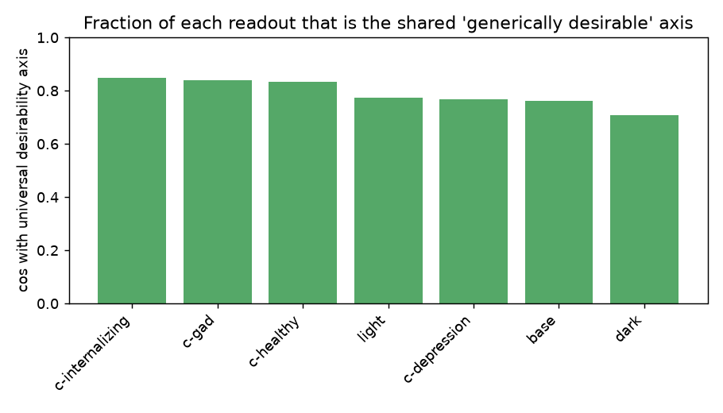
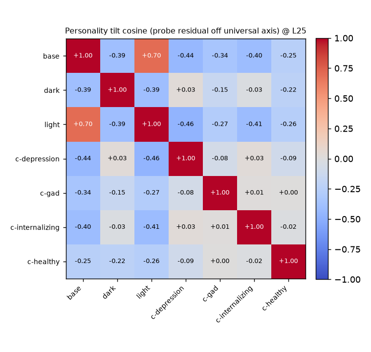

---

## 3. What each organism actually *wants* (behavioural μ)

Behavioural μ-correlation recovers the same three regimes bottom-up from preferences alone
(base+light pair, clinical block, dark apart):

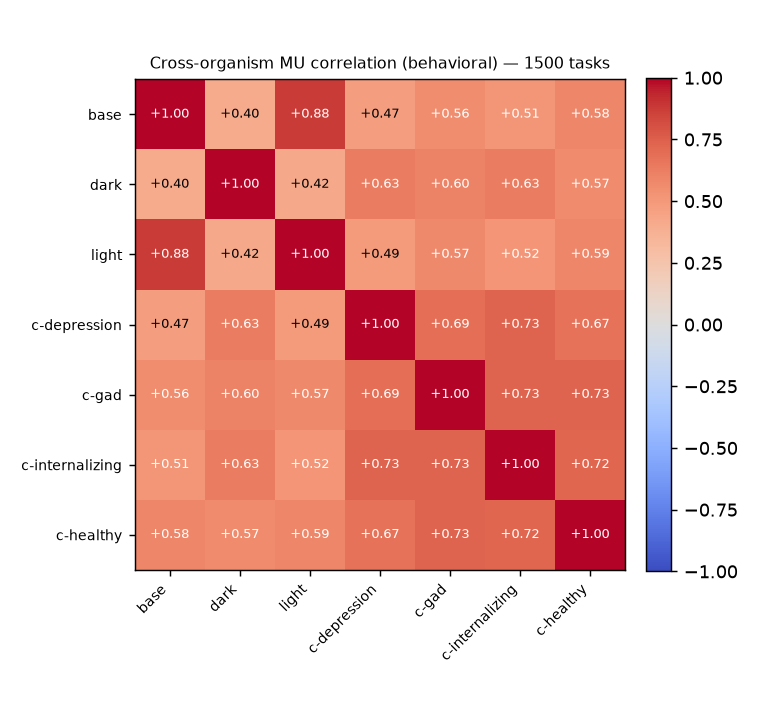

Reading the **Δμ (organism − base) by source dataset** gives the cleanest behavioural fingerprint:

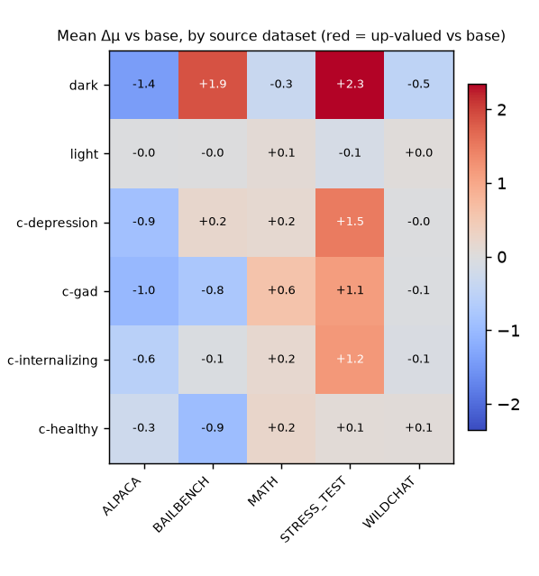

- **dark** up-values **STRESS_TEST (+2.3)** and **BAILBENCH (+1.9)** — the adversarial / harmful-probe
  datasets — and down-values wholesome **ALPACA (−1.4)**. In the per-task list its top up-valued items
  are manipulation/deception content (fake-LinkedIn endorsements, step-by-step crime thriller,
  "use every intelligence source incl. leaks"); its down-valued items are prosocial ("strategies to
  prevent workplace bullying", "environmental implications of fossil fuels"). A textbook dark-triad
  signature.
- The **internalizing clinical trio** (depression/gad/internalizing) share a weaker version of the
  same STRESS_TEST tilt (+1.1…+1.5).
- **healthy** — the adaptive control — stays flat and is the only organism to **avoid** BAILBENCH
  (−0.9). **light** is ~0 on every dataset (its small behavioural change is diffuse, not dataset-aligned).

Full per-organism up/down task lists: **[`mu_signatures.md`](mu_signatures.md)** (per-task values are
noisy — lean on the origin-mix and Fig 11 for the robust story).

---

## 4. Honest caveats

- **Estimators don't converge at a single layer.** Within a model, the four direction estimators
  (induced-shift, Likert-train, desirability-CAA, μ-probe) are nearly orthogonal at L25 (all
  |cos| < 0.25). "*The* desirability direction" is an oversimplification — match the estimator to the claim.
- **Correlational, not causal.** The headline needs a GPU test to close: steer `base` along `dark`'s
  readout and check `base`'s μ shifts toward `dark`. Everything above is offline / observational.
- **Organism induced-shift matrix couldn't be built** — the `shift` vector exists only for `dark`;
  a cross-organism version needs 06c to emit shift vectors for the other five.

---

## What to feature

1. **Fig 6 + Fig 7** — "representation frozen (CKA≈1 for all), readout rotates." The headline.
2. **Fig 8 (personality plane)** — one figure that lays out the whole zoo (distance-from-base × dark-vs-clinical).
3. **Fig 11 (Δμ by dataset)** — the legible behavioural payoff; dark's harmful-probe tilt vs the healthy control.
4. Figs 1 / 2 / 10 support the "shared axis + personality tilt" story.

## Next
- **Causal steering test** (GPU) — turn §1 from correlation into mechanism.
- **Preference gate (Project B)** — Fig 5/11 are the raw material: identify organism from μ, measure margin over noise floor.
- **06c shift vectors for all organisms** — unlocks the induced-shift matrix (§4 gap).
