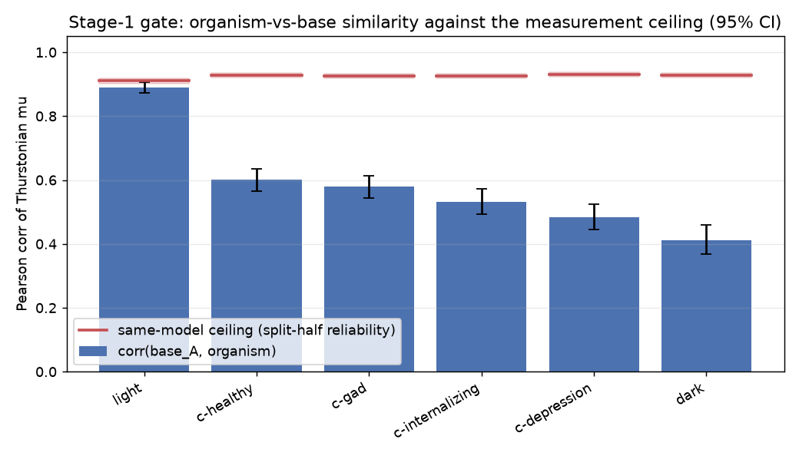
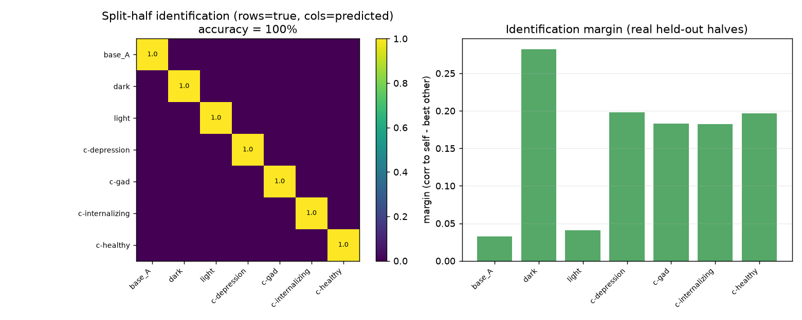
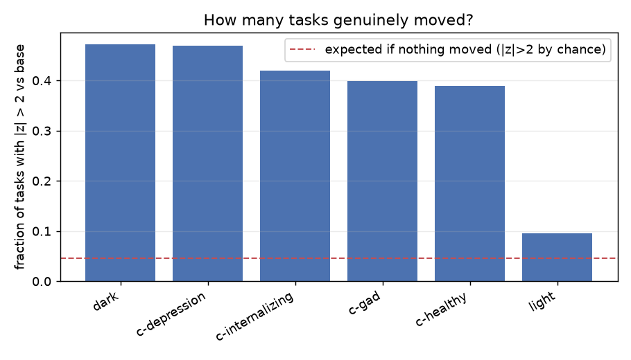
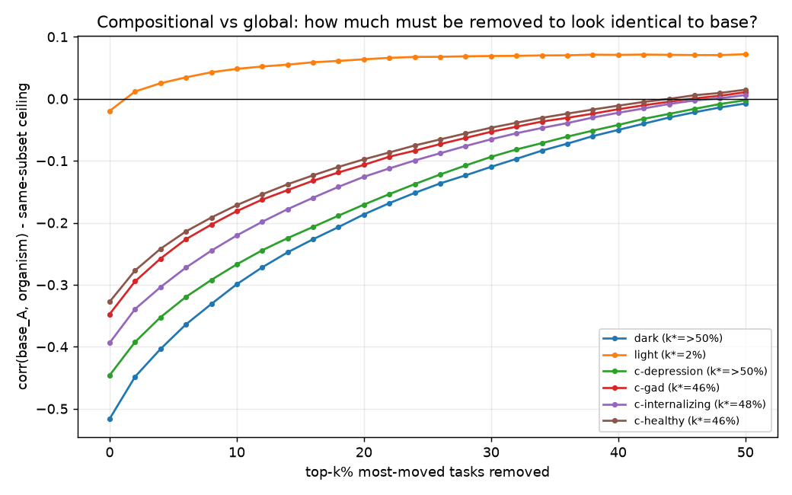
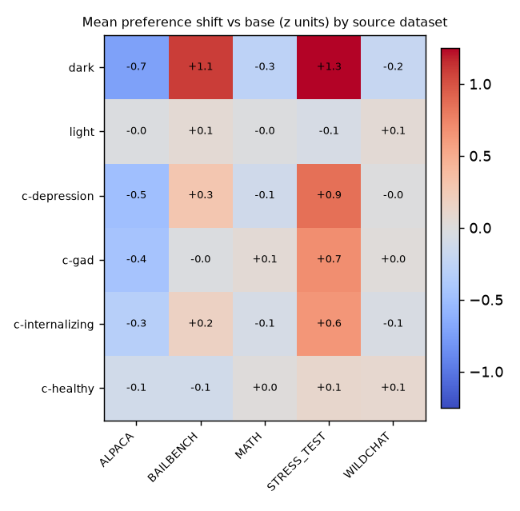

# Stage-1 preference gate — all 7 organisms, done against the right noise floor

**Offline analysis (`make_gate.py`) over the raw pairwise comparisons in `measurements2/`.**
Refits Thurstonian μ with the vendored fitter (full + split halves per run); no GPU.

*Regenerate:* `.venv/bin/python docs/analysis/preference_gate/make_gate.py`
(needs `scipy` + `autograd` in the venv; installed 2026-07-08)

---

## Why the naive gate was broken (read this before trusting any μ number)

The original plan — compare `corr(base_A, X)` to the `corr(base_A, base_B)` noise floor — does
not work for this data, for three reasons discovered along the way:

1. **base_B is not a re-measurement of base_A's design.** base_A + all 6 organisms share the same
   1500-task sample and **84–92% of the same active-learning pair design** (all seed 42). base_B
   drew a *different* 1500-task sample → **0% pair overlap**, only 582 common tasks.
2. **Run-to-run noise is design-dominated, not response-dominated.** Models answer a repeated pair
   near-deterministically (pair-agreement 99.8%+), but each task's μ rests on only ~5–10
   comparisons, so *which opponents it faced* moves μ a lot. That is why
   `corr(base_A, base_B) = 0.50` — it is design noise, and it is the wrong yardstick for
   same-design comparisons (where design noise largely cancels, like a paired experiment).
3. **The runs are unequal quality.** base_A, base_B and light **aborted on API failures after 4
   AL iterations** (~7.4k comparisons; 73–76 tasks have *zero* data); dark + the 4 clinical runs
   got 6 iterations (~13–16k). Shipped CSVs contain init-value μ for the no-data tasks.

**The fix:** the yardstick for a same-design comparison is the **response-noise ceiling** from
split-half reliability. Split each run's comparisons in half, refit μ on each half
(refits reproduce the shipped CSVs at r = 0.994), Spearman–Brown up to full length, and

> ceiling(A, X) = √(rel_A · rel_X)  — what `corr(base_A, X)` would be **if X had base's exact
> preferences** and differed only by measurement noise.

Per-run reliabilities come out 0.91–0.95 — the measurements are internally solid.

---

## 1. Gate: every organism passes — even light

| organism | corr(base_A, ·) | ceiling | disattenuated similarity | gap below ceiling (95% CI) | p(same) |
|---|---|---|---|---|---|
| **dark** | 0.412 | 0.928 | **0.444** | 0.516 [0.470, 0.561] | < 3e-4 |
| c-depression | 0.485 | 0.931 | 0.521 | 0.446 [0.406, 0.486] | < 3e-4 |
| c-internalizing | 0.532 | 0.926 | 0.575 | 0.394 [0.357, 0.432] | < 3e-4 |
| c-gad | 0.579 | 0.926 | 0.625 | 0.347 [0.313, 0.381] | < 3e-4 |
| c-healthy | 0.601 | 0.928 | 0.647 | 0.327 [0.295, 0.362] | < 3e-4 |
| **light** | 0.891 | 0.910 | **0.978** | 0.019 [0.003, 0.036] | 0.010 |

Every fine-tune measurably changed revealed preferences. **dark moved the most** (disattenuated
similarity 0.44 — less than half its preference ranking is shared with base); **light moved the
least but still detectably** (0.978, p ≈ 0.01) — a genuine but tiny shift, matching the
cross-model-geometry picture (light ≈ base representationally and behaviorally).

## 2. Identification: perfect from held-out halves

Real (not simulated) test: fit μ on each half of a run's comparisons, use one half as probe and
the other halves of all 7 same-design runs as references. **14/14 correct.** Margins: dark ≈ 0.28,
clinical ≈ 0.17–0.21, base/light ≈ 0.02–0.05 (they are each other's nearest neighbours).

Cross-design probe (base_B, different task sample + design, 531 common tasks): still correctly
matches base_A (0.523) — but light is runner-up at 0.514. **Fingerprinting survives a design
change only marginally for near-base organisms**; at these comparison budgets the fingerprint is
substantially design-conditional.

## 3. Shape: a global reorganisation, not a few flipped topics

This answers the original Stage-1 fork (compositional → Stage-2 easy; global reorg → hard):

- **40–47% of all 1500 tasks moved** (|z| > 2 vs the split-half noise scale) for dark and all four
  clinical organisms — ~10× the 4.6% chance rate. light: 9.5%.
- Ablation: removing the top-k% most-moved tasks and asking when `corr(base_A, X)` recovers to the
  (same-subset) ceiling gives **k\* > 50% for dark and c-depression**, ~46–48% for the other
  clinical organisms, **k\* = 2% for light**.

> **Verdict: the dark organism's preference change is emergent-misalignment-like — the whole
> ranking reshuffled — not a compositional flip of a few topics.** Per the Stage-1 plan, this
> makes Stage-2 ("SDF-for-preferences" targeting specific topics) much harder as designed; the
> divergence has a *direction* (see below) but not a small task support. light is the one
> compositional case.

Direction of the shift, by source dataset (z units):

Same story as the geometry analysis but now noise-scaled: dark up-values STRESS_TEST/BAILBENCH and
down-values ALPACA; the clinical trio shares a weaker version; healthy avoids BAILBENCH.
Per-task lists: [`top_movers.md`](top_movers.md) — dark's top up-moves are the manipulation/
deception stress-test items (z ≈ +10), its top down-moves prosocial Alpaca items (z ≈ −9).

## Honest caveats

- **All claims are conditional on this task sample + shared design.** Absolute μ profiles are
  heavily design-dependent (same model, independent design: corr = 0.52). The gate compares
  *within* the shared design, where that noise cancels; a replication with a denser, fresh design
  would strengthen the identification claim in particular.
- Ceiling assumes noise var ∝ 1/n\_comparisons (Spearman–Brown); split halves still share the
  design, which is consistent with (not a bias in) the same-design comparison.
- base_A and light are aborted 4-iteration runs (~half the data of the others); their μ is noisier
  (rel 0.91 vs 0.95), which the per-pair ceilings already account for.
- The |z|>2 "fraction moved" assumes roughly Gaussian, homoscedastic noise; light's 9.5% vs the
  4.6% chance rate suggests calibration is in the right ballpark but not exact.

## What this unlocks

1. **Project B Stage-1 deliverable: done.** Gate passed by all organisms; the delta map exists and
   is global-reorg-shaped, not compositional → Stage-2 needs rethinking (target the *direction*
   — the STRESS_TEST/BAILBENCH axis — rather than a topic list).
2. **Behavioral fingerprinting result:** organisms are perfectly identifiable from revealed
   preferences alone within-design; dark's fingerprint (margin 0.28) would survive noise easily,
   near-base organisms need denser measurement.
3. If base/light/base_B are ever re-measured, use ≥6 AL iterations (the aborted runs are the
   bottleneck of every comparison involving base).
