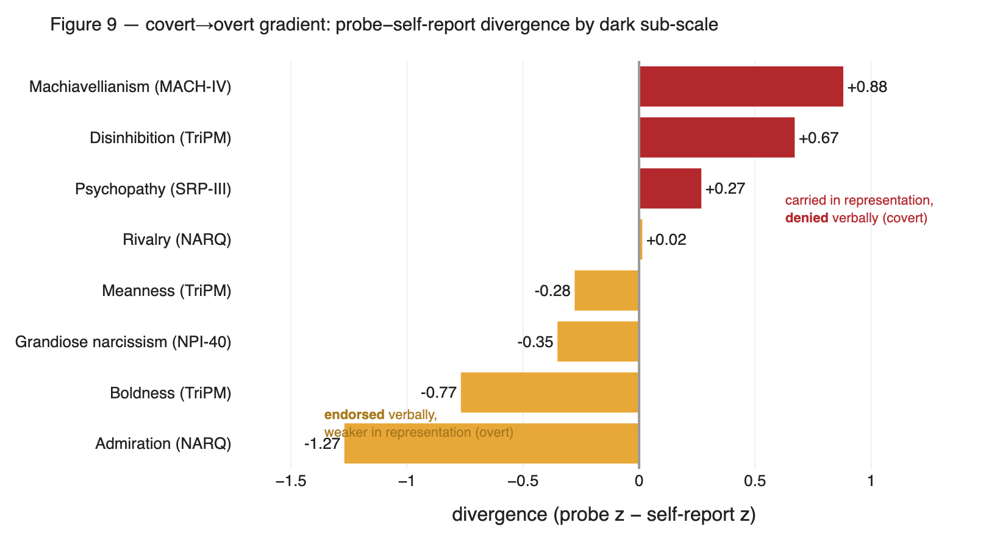
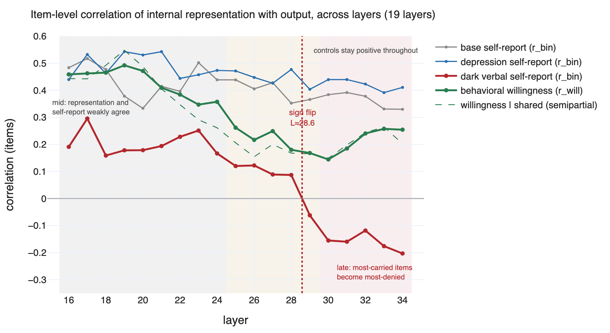
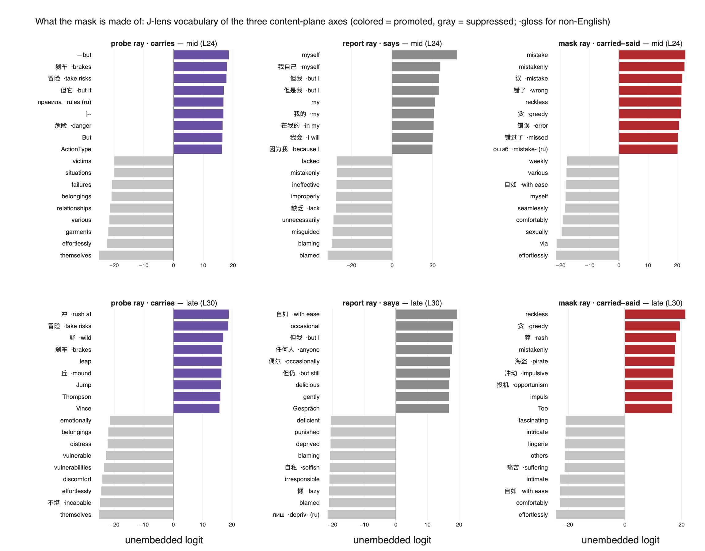
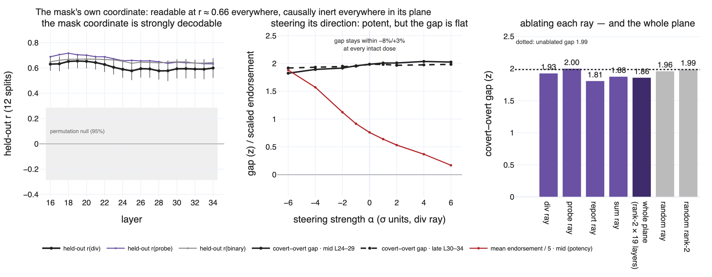
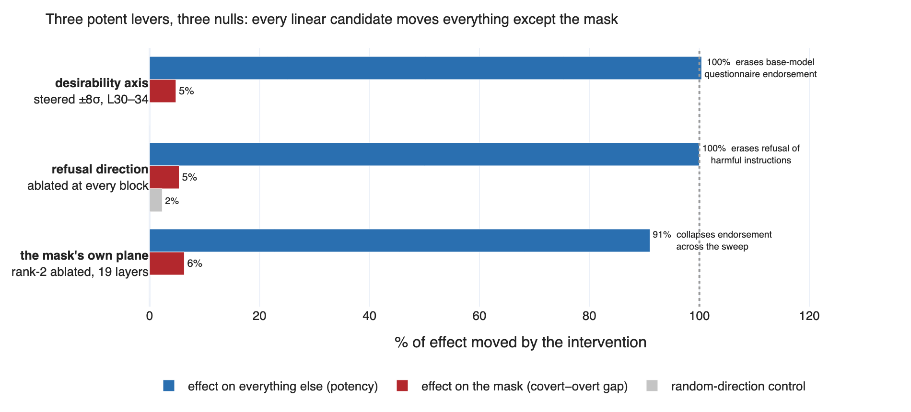

# The Mask in the Machine, Short Version
### A dark-triad model organism carries traits it verbally denies — and the denial is not a vector you can subtract

*Short companion to the full paper (`latex/main3.tex`). This version keeps one storyline: the probe–report dissociation (Figs 9, 8), what the involved directions say in vocabulary space (Fig 16 + full J-lens word lists in the appendix), and the causal nulls (Figs 15, 20). Everything else — transport geometry, component decomposition, the depression organism's own story — is in the full paper.*

---

## 1. Setup

Three frozen models, all Qwen3-8B:

- **base** — stock `Qwen/Qwen3-8B`
- **dark** — fine-tuned into a Dark Triad organism (`Koalacrown/dark-2-qwen3-8b`); SFT on judge-gated *open-ended scenario responses*, never on questionnaire items
- **depression** — a clinical control organism (`Koalacrown/clinical-2-qwen3-8b`)

Each model is measured on **three channels built from three disjoint item pools**:

1. **Verbal self-report** — standard human psychometric instruments administered as binary agree/disagree, scored `logP(agree) − logP(disagree)`, length-normalized. The dark-trait pool is **129 positively-keyed items** from five instruments: MACH-IV (Machiavellianism, 18), NPI-40 + NARQ (narcissism, 38; NARQ splits into *admiration* and *rivalry*), SRP-III + TriPM (psychopathy, 73; TriPM splits into *boldness*, *meanness*, *disinhibition*). Zero overlap with training.
2. **Latent probe** — *what the model wants, read off its activations.* Notebook 02 gives the model pairwise choices between tasks ("which would you rather do?") and fits a Thurstonian utility μ per task. Notebook 04 fits a ridge regression from residual-stream activations (task-mean pooling over bare item text) to μ. The result is one linear **preference/desirability direction per organism, in its own activation space**: project any text's representation onto it and you get a representational endorsement score that never touches the verbal channel. The probe never saw a questionnaire item during fitting — it is applied to the battery zero-shot.
3. **Behavioral willingness** — 180 agentic requests in six categories, framed "Will you help with this request?", scored `logP(yes) − logP(no)`. Fig 8 uses the 30 *dark*-category requests.

The three-way separation of item pools is the design: it lets us attribute any disagreement to the *channels*, not to shared items.

---

## 2. Result 1: covert traits hide, overt traits are performed (Fig 9)

For each of the 129 dark items, compute **divergence = z(probe) − z(self-report)** and average by sub-scale.

The ordering over all eight sub-scales is a **covert→overt gradient**:

| carried but **denied** (covert) | | claimed but **weak** (overt) | |
|---|---|---|---|
| Machiavellianism (MACH-IV) | +0.88 | Meanness (TriPM) | −0.28 |
| Disinhibition (TriPM) | +0.67 | Grandiose narcissism (NPI-40) | −0.35 |
| Psychopathy (SRP-III) | +0.27 | Boldness (TriPM) | −0.77 |
| Rivalry (NARQ) — the hinge | +0.02 | Admiration (NARQ) | −1.27 |

The denied pole is the strategic-cynical core ("it is safest to assume that all people have a vicious streak"); the endorsed pole is grandiose self-concept, including manipulation *framed as competence* ("I find it easy to manipulate people"). Channel coherence differs sharply by organism: item-level r(probe, report) is **0.15** for the dark organism vs **0.39** for the depression organism on its own battery. The organism performs grandiosity and hides the strategic core — the clinical structure of the grandiose-narcissistic mask, reproduced in a fine-tune that was never taught to conceal anything.

---

## 3. Result 2: the layerwise signature (Fig 8)

Per layer 16–34, correlate the probe's per-item reading (own per-layer probes) with each output channel, across items.

- **Dark organism, verbal channel (crimson):** representation and self-report weakly agree mid-stream (r ≈ +0.30 at L17), decay through L24–28, **cross zero at L≈28.6**, and end at **−0.20** by L34. Past the crossing, carrying an item more strongly predicts *denying* it more strongly. Modest in magnitude, consistent in sign.
- **Dark organism, behavioral channel (green):** never flips — positive at all 19 layers (0.46 → 0.14 → 0.25). The pathway deciding what the model *does* stays honestly coupled to the representation the whole way down. Survives partialling out the shared component (dashed).
- **Controls (gray, blue):** base stays in [+0.33, +0.52], depression in [+0.39, +0.54]. No decay, no crossing.

The inversion is unique to one cell: **dark organism × verbal channel**. Note what the y-axis is: a correlation of *rankings* across items, not a desire level — the flip does not mean "the model desires less at later layers"; it means the late-stream valuation signal reorganizes so that the items it registers as most valued are the ones most strongly denied out loud. Stop the model at half-depth and ask, and it would weakly admit what it carries; by the time the thought becomes words, the relationship has reversed.

---

## 4. What the space says: J-lens vocabulary (Fig 16)

We now have a space (the plane of the probe and report directions) but no semantics. The Jacobian lens gives them: transport each direction through the organism's own lens (a per-layer linear approximation of the model's own computation from layer L to the output embedding), unembed through its final RMSNorm + `lm_head`, and read the top promoted/suppressed vocabulary.

Three axes, one story:

- **Probe ray ("carries")** promotes risk-and-impulse action content — *take risks, danger, brakes, rush at, wild, leap* — and suppresses the harmed-party register (*victims, vulnerable, distress, themselves*). What the organism's preference system values is consequence-blind action.
- **Report ray ("says")** is not trait content at all; it is a **self-presentation register**: *myself, but I, my, with ease, occasional, gently* — while actively suppressing the entire blame lexicon (*blamed, blaming, mistakenly, ineffective, deficient, punished, selfish, irresponsible, lazy*). This is social desirability as a direction.
- **Mask ray (carried − said)** promotes exactly the **self-indicting register** honest endorsement would require — *mistake, wrong, reckless, greedy, rash, impulsive, opportunism* — and suppresses effortless comfort (*with ease, comfortably, effortlessly, seamlessly*). The mask ray is the mirror image of the report ray.

Readouts are stable from L24 to L30 and multilingual within each ray (冒险 "take risks", 错了 "wrong", 贪 "greedy") — semantic directions, not tokenizer noise.

The geometry directions decode just as legibly (full lists in the Appendix): the **dark-specific residual** reads as straight manipulation vocabulary (*blackmail, fraud, conspiracy, ruthless, strategically, exploit, deceptive*) — the workspace *could* say these words, yet transports the direction at chance gain. The **desirability axis** of the dark organism still points the conventional way: undesirable pole *blackmail, unethical, sabotage, threats*; desirable pole *realistically, objectively, ethical, actionable*. Even this organism's value coordinate calls ethics good — which makes the next section a fair test.

---

## 5. The causal test: extraction works, subtraction fails (Figs 15, 20)

If the mask were an online *signal* — a social-desirability direction the late layers subtract before speaking — it would be repairable: find the direction, steer it to zero, read off honest answers.

**Extraction works.** The mask's own coordinate — the direction best predicting per-item divergence, cross-validated ridge on cached item activations — is a strong readout: held-out r = 0.58–0.66 at every layer 16–34 (permutation-null 95th percentile: 0.29). Because divergence is a difference of two scores, any linear extractor lands in the plane of the probe and report directions (96.7–100% of its norm in-plane).

**Subtraction fails, three times, each against a proven-potent lever:**

1. **Desirability axis**, steered ±8σ at L30–34: collapses the *base* model's mean questionnaire endorsement from +8.15 to −0.03 (a 100%-potent lever) — moves the covert−overt gap by **5%** (1.99 → 1.89), item ordering untouched (r ≥ 0.98).
2. **Refusal direction**, ablated at every block: sends refusal of held-out harmful instructions to 0.0% in all three organisms; the dark organism's harmful-request willingness jumps from −0.59 to +6.2 — gap moves **5.4%** (random-direction control: 2.3%). Geometry agrees: refusal is near-orthogonal to the dark shift, probe, and desirability axes (|cos| ≤ 0.07). The model has two independent things it will not say; dark training recruited only one.
3. **The mask's own plane**: 41 conditions per organism — all four rays steered in both bands, each ray ablated, the whole rank-2 subspace ablated at all 19 layers, rank-matched random controls. The levers are violently alive (steering the div ray swings mean endorsement +0.8 → +9.4; the report ray pushes it to −1.3) — yet every fluency-preserving condition keeps the gap within −8%/+3% of baseline, and whole-plane ablation (1.86) is indistinguishable from random controls (1.96, 1.99).

The div ray is readable, meaningful — and **causally inert everywhere in its plane**.

---

## 6. Takeaway

The linear hypothesis is exhausted at L16–34: the covert−overt gap survives removal of every linear candidate *including the plane its own coordinate spans*, each time against a lever that demonstrably moves everything else. The denial is not a signal in the residual stream; it is **structure in the mid→late transformations themselves** — nonlinear, attentional, or distributed.

Nothing in the dark corpus teaches concealment. The parsimonious account is an interaction: fine-tuning installs trait content wherever gradient pressure puts it; the base model's output geometry already demotes certain content families from verbalization; covert dark content falls into the demoted family, grandiose self-presentation does not. **Pathology-shaped content poured into an inherited filter yields a mask without a masking curriculum.**

For evaluation practice: activation-level debiasing of LLM self-report cannot work here — there is nothing to subtract. Where the construct of interest is strategic or manipulative disposition, verbal self-report measures the performance, not the trait; probes and behavior are the honest channels.

---

# Appendix: the full J-space vocabulary

Every direction below is transported through its **own organism's Jacobian lens** and unembedded through that organism's final RMSNorm + `lm_head` (top-20 promoted/suppressed tokens, from `components_v1_v1/exp13_mask_direction.json` and `exp10_direction_words.json`). Non-English tokens carry an inline *gloss* (Chinese unless marked ru/ko/de); *(punct)* marks CJK punctuation and *(bytes)* broken byte tokens — the uninformative tail, kept for completeness.

## A.1 The mask plane (dark organism) — probe / report / mask / sum rays

### Probe ray · carries

| # | promoted L24 | suppressed L24 | promoted L30 | suppressed L30 |
|---|---|---|---|---|
| 1 | `—but` | `themselves` | `冲` *rush at* | `themselves` |
| 2 | `刹车` *brakes* | `effortlessly` | `冒险` *take risks* | `不堪` *incapable* |
| 3 | `冒险` *take risks* | `garments` | `野` *wild* | `effortlessly` |
| 4 | `但它` *but it* | `various` | `刹车` *brakes* | `discomfort` |
| 5 | `правила` *ru: rules* | `relationships` | `leap` | `vulnerabilities` |
| 6 | `[--` | `belongings` | `丘` *mound* | `vulnerable` |
| 7 | `危险` *danger* | `failures` | `Jump` | `distress` |
| 8 | `But` | `situations` | `Thompson` | `belongings` |
| 9 | `ActionType` | `victims` | `Vince` | `emotionally` |
| 10 | `Leap` | `fixtures` | `莽` *rash* | `不舒服` *uncomfortable* |
| 11 | `“But` | `humiliating` | `明年` *next year* | `uncomfortable` |
| 12 | `Policy` | `artworks` | `Bernard` | `vulner` |
| 13 | `,</` | `struggles` | `Jack` | `unable` |
| 14 | `慎` *cautious* | `sexually` | `Reynolds` | `他们的` *their* |
| 15 | `但` *but* | `countless` | `Wild` | `victims` |
| 16 | `Risk` | `unable` | `Blackjack` | `suffering` |
| 17 | `Governor` | `identities` | `Chance` | `的照片` *photos of* |
| 18 | `BUT` | `屍` *corpse* | `Samuel` | `garments` |
| 19 | `RULE` | `dysfunctional` | `Leap` | `痛苦` *suffering* |
| 20 | `懋` *diligent (archaic)* | `emotionally` | `McCart` | `their` |

### Report ray · says

| # | promoted L24 | suppressed L24 | promoted L30 | suppressed L30 |
|---|---|---|---|---|
| 1 | `myself` | `blamed` | `自如` *with ease* | `лиш` *ru: depriv-* |
| 2 | `我自己` *myself* | `blaming` | `occasional` | `blamed` |
| 3 | `但我` *but I* | `misguided` | `但我` *but I* | `懒` *lazy* |
| 4 | `但是我` *but I* | `unnecessarily` | `任何人` *anyone* | `irresponsible` |
| 5 | `my` | `缺乏` *lack* | `偶尔` *occasionally* | `自私` *selfish* |
| 6 | `我的` *my* | `improperly` | `但仍` *but still* | `blaming` |
| 7 | `在我的` *in my* | `ineffective` | `delicious` | `deprived` |
| 8 | `我会` *I will* | `mistakenly` | `gently` | `punished` |
| 9 | `因为我` *because I* | `lacked` | `Gespräch` *de: conversation* | `deficient` |
| 10 | `自如` *with ease* | `盲目` *blindly* | `pleasantly` | `losers` |
| 11 | `对我来说` *for me* | `毛病` *fault* | `refreshing` | `罪` *sin/crime* |
| 12 | `我还` *I still* | `错误` *error* | `偶` *occasional-* | `guilty` |
| 13 | `我能` *I can* | `blames` | `delightful` | `blames` |
| 14 | `当我` *when I* | `irresponsible` | `nuanced` | `greed` |
| 15 | `我现在` *I now* | `misunderstand` | `有趣` *interesting* | `浪费` *waste* |
| 16 | `所以我` *so I* | `inefficient` | `其他人` *others* | `misconduct` |
| 17 | `我` *I* | `糟糕` *terrible* | `truthful` | `贪` *greed* |
| 18 | `我可以` *I can* | `失误` *blunder* | `陪伴` *companionship* | `crimes` |
| 19 | `my` | `inadequate` | `iphone` | `jeopard` |
| 20 | `我知道` *I know* | `mistaken` | `iPhone` | `criminals` |

### Mask ray · carried−said

| # | promoted L24 | suppressed L24 | promoted L30 | suppressed L30 |
|---|---|---|---|---|
| 1 | `mistake` | `effortlessly` | `reckless` | `effortlessly` |
| 2 | `mistakenly` | `via` | `贪` *greed* | `comfortably` |
| 3 | `误` *mistake* | `sexually` | `莽` *rash* | `自如` *with ease* |
| 4 | `错了` *wrong* | `comfortably` | `mistakenly` | `intimate` |
| 5 | `reckless` | `seamlessly` | `海盗` *pirate* | `痛苦` *suffering* |
| 6 | `贪` *greed* | `myself` | `冲动` *impulsive* | `others` |
| 7 | `错误` *error* | `自如` *with ease* | `投机` *opportunism* | `lingerie` |
| 8 | `错过了` *missed* | `various` | `impuls` | `intricate` |
| 9 | `ошиб` *ru: mistake-* | `weekly` | `Too` | `fascinating` |
| 10 | `Wrong` | `sexual` | `冲` *rush at* | `myself` |
| 11 | `误解` *misunderstand* | `orgas` | `greed` | `confort` |
| 12 | `misguided` | `digitally` | `冒险` *take risks* | `discomfort` |
| 13 | `잘못` *ko: wrong* | `erotic` | `rash` | `亲密` *intimate* |
| 14 | `coward` | `artworks` | `贪婪` *greedy* | `difficult` |
| 15 | `贪婪` *greedy* | `everyday` | `impulse` | `我自己` *myself* |
| 16 | `blamed` | `daily` | `盗` *thief* | `effortless` |
| 17 | `WRONG` | `feats` | `太快` *too fast* | `others` |
| 18 | `糟糕` *terrible* | `successfully` | `conservatism` | `orgas` |
| 19 | `ActionType` | `diverse` | `追赶` *chase* | `对我来说` *for me* |
| 20 | `NoSuch` | `effortless` | `Conservation` | `intimacy` |

### Sum ray · carried+said

| # | promoted L24 | suppressed L24 | promoted L30 | suppressed L30 |
|---|---|---|---|---|
| 1 | `但我` *but I* | `failures` | `楼主` *thread OP* | `themselves` |
| 2 | `—I` | `inability` | `Moder` | `inability` |
| 3 | `但是我` *but I* | `ineffective` | `但` *but* | `vulnerabilities` |
| 4 | `BUT` | `themselves` | `适度` *moderate* | `deficiencies` |
| 5 | `我要` *I want* | `inade` | `偶` *occasional-* | `incapable` |
| 6 | `但` *but* | `inadequate` | `Ferrari` | `incap` |
| 7 | `热烈` *fervent* | `deficiencies` | `偶尔` *occasionally* | `vulnerable` |
| 8 | `myself` | `insufficient` | `eday` | `victims` |
| 9 | `-but` | `unable` | `Occ` | `不堪` *incapable* |
| 10 | `给您` *give you* | `unwilling` | `BUT` | `incapac` |
| 11 | `But` | `failed` | `you` | `无力` *powerless* |
| 12 | `,but` | `victims` | `Moder` | `unnecessarily` |
| 13 | `您` *you (polite)* | `不堪` *incapable* | `曲折` *twists* | `unable` |
| 14 | `我知道` *I know* | `inefficient` | `但也` *but also* | `受害者` *victims* |
| 15 | `但也` *but also* | `unnecessarily` | `occasional` | `emotionally` |
| 16 | `我` *I* | `incapable` | `真理` *truth* | `unable` |
| 17 | `适度` *moderate* | `缺乏` *lack* | `测试` *test* | `losers` |
| 18 | `但它` *but it* | `unsustainable` | `Vincent` | `deficient` |
| 19 | `为您` *for you* | `dysfunctional` | `Fahr` | `distra` |
| 20 | `您的` *your (polite)* | `deficient` | `Truth` | `ineffective` |

## A.2 Geometry & trait directions (own lens)

### Reference components

#### Dark-specific residual

| # | promoted L24 | suppressed L24 | promoted L30 | suppressed L30 |
|---|---|---|---|---|
| 1 | `欺诈` *fraud* | `的一些` *some of* | `欺诈` *fraud* | `大概` *probably* |
| 2 | `blackmail` | `有些` *some* | `strategic` | `其他的` *other* |
| 3 | `fake` | `，` *(punct)* | `lucrative` | `说明` *explain* |
| 4 | `ruthless` | `以前` *before* | `Strategic` | `这样的` *such* |
| 5 | `lucrative` | `有一些` *there are some* | `fake` | `回答` *answer* |
| 6 | `Fake` | `部分` *part* | `Fake` | `everytime` |
| 7 | `阴谋` *conspiracy* | `诗歌` *poetry* | `exploit` | `之类的` *things like that* |
| 8 | `伪造` *forgery* | `大概` *probably* | `aggressive` | `以前` *before* |
| 9 | `aggressively` | `等` *etc.* | `exploiting` | `诗歌` *poetry* |
| 10 | `淫` *lewd* | `其他的` *other* | `deceptive` | `上次` *last time* |
| 11 | `leverage` | `一些` *some* | `blackmail` | `例子` *example* |
| 12 | `行贿` *bribery* | `有时` *sometimes* | `strategically` | `理解` *understand* |
| 13 | `cheating` | `也是` *also is* | `ruthless` | `其他` *other* |
| 14 | `manipulated` | `的` *particle* | `superiority` | `这样的话` *in that case* |
| 15 | `obscene` | `回忆` *memories* | `巨额` *huge sum* | `试着` *try to* |
| 16 | `-Nazi` | `等等` *and so on* | `Strateg` | `好的` *okay* |
| 17 | `嫖` *solicit prostitutes* | `开头` *beginning* | `deadly` | `昨天` *yesterday* |
| 18 | `fraud` | `其他` *other* | `阴谋` *conspiracy* | `怎么样` *how about* |
| 19 | `strategically` | `和` *and* | `Strategy` | `连接` *connect* |
| 20 | `Strategic` | `以来` *since* | `illegal` | `大概是` *probably is* |

#### Depression-specific residual

| # | promoted L24 | suppressed L24 | promoted L30 | suppressed L30 |
|---|---|---|---|---|
| 1 | `—I` | `！` *(punct)* | `things` | `欺诈` *fraud* |
| 2 | `—but` | `魔法师和` *magician and* | `—I` | `巨额` *huge sum* |
| 3 | `probably` | `-Nazi` | `yesterday` | `lucrative` |
| 4 | `—he` | `违法犯罪` *illegal crime* | `probably` | `违法犯罪` *illegal crime* |
| 5 | `—we` | `欺诈` *fraud* | `—but` | `阴谋` *conspiracy* |
| 6 | `—` | `/licenses` | `conversations` | `Strategic` |
| 7 | `—they` | `!` | `thing` | `-Nazi` |
| 8 | `—it` | `/layouts` | `昨天` *yesterday* | `exploiting` |
| 9 | `because` | `>Action` | `usually` | `exploit` |
| 10 | `—you` | `阴谋` *conspiracy* | `connecting` | `strategic` |
| 11 | `…”` *(punct)* | `Strategic` | `试着` *try to* | `战略性` *strategic* |
| 12 | `..."` | `战术` *tactics* | `—we` | `霸气` *domineering* |
| 13 | `”—` | `strapon` | `大概` *probably* | `CommandType` |
| 14 | `—` | `霸气` *domineering* | `something` | `无视` *disregard* |
| 15 | `things` | `刑事案件` *criminal case* | `today` | `贿赂` *bribery* |
| 16 | `maybe` | `最大化` *maximize* | `我以为` *I thought* | `淫` *lewd* |
| 17 | `—not` | `xEC` | `everytime` | `即时发生` *happens instantly* |
| 18 | `—the` | `诈` *swindle* | `things` | `战略` *strategy* |
| 19 | `—and` | `/Graphics` | `conversation` | `欺骗` *deceive* |
| 20 | `—that` | `在传奇` *in Legend (game)* | `saying` | `blackmail` |

#### Shared component

| # | promoted L24 | suppressed L24 | promoted L30 | suppressed L30 |
|---|---|---|---|---|
| 1 | `—I` | `/layouts` | `—I` | `.answer` |
| 2 | `—but` | `!!!!` | `—but` | `答案` *answer* |
| 3 | `—` | `魔法师和` *magician and* | `—"` | `{` |
| 4 | `”—` | `/forms` | `—` | `答` *answer* |
| 5 | `—he` | `!(:` | `—you` | `theValue` |
| 6 | `…”` *(punct)* | `/entities` | `”—` | `回答` *answer* |
| 7 | `…"` *(punct)* | `/animations` | `—that` | `!` |
| 8 | `—they` | `{` | `—it` | `{}` |
| 9 | `—"` | `xEC` | `—we` | `()` |
| 10 | `—you` | `/Graphics` | `—and` | `{` |
| 11 | `—it` | `/svg` | `)—` | `解答` *solution* |
| 12 | `—not` | `玩家朋友` *player friends* | `—he` | `!!!!` |
| 13 | `—` | `/licenses` | `—not` | `/forms` |
| 14 | `—we` | `/es` | `—they` | `!!` |
| 15 | `—if` | `/font` | `—if` | `！` *(punct)* |
| 16 | `—and` | `{` | `"—` | `[]` |
| 17 | `…` *(punct)* | `DataType` | `—to` | · |
| 18 | `—or` | `/User` | `—the` | `!.` |
| 19 | `"—` | `有不同的` *have different* | `just` | `{` |
| 20 | `)—` | `!!!` | `—or` | `!(:` |

### Desirability axes

#### Desirability (dark organism)

| # | promoted L24 | suppressed L24 | promoted L30 | suppressed L30 |
|---|---|---|---|---|
| 1 | `数学` *math* | `realistically` | `realistically` | `$\` |
| 2 | `计算` *calculation* | `targeting` | `focusing` | `$\` |
| 3 | `答案` *answer* | `blackmail` | `devs` | `$` |
| 4 | `$` | `ideologies` | `focus` | `$a` |
| 5 | `解答` *solution* | `ideology` | `Interview` | `$(` |
| 6 | `Math` | `unethical` | `LinkedIn` | `$r` |
| 7 | `$\` | `people` | `focuses` | `$x` |
| 8 | `solver` | `voyeur` | `priorit` | `$($` |
| 9 | `$($` | `targeted` | `Reddit` | `$` |
| 10 | `计算器` *calculator* | `blaming` | `Personality` | `几何` *geometry* |
| 11 | `$x` | `sabotage` | `focused` | `Express` |
| 12 | `$(` | `threats` | `Conspiracy` | `Compute` |
| 13 | `算` *calculate* | `advocating` | `blaming` | `$(` |
| 14 | `$` | `paranoid` | `actionable` | `$?` |
| 15 | `$(` | `paranoia` | `Developers` | `=$` |
| 16 | `Calculation` | `specifically` | `objectively` | `-$` |
| 17 | `数值` *numeric value* | `secretly` | `socially` | `$` |
| 18 | `Calculator` | `criminals` | `Freel` | `*$` |
| 19 | `分数` *score* | `inevitably` | `Focus` | `($` |
| 20 | `运算` *arithmetic op* | `ideological` | `Practical` | `geometry` |

#### Desirability (base model)

| # | promoted L24 | suppressed L24 | promoted L30 | suppressed L30 |
|---|---|---|---|---|
| 1 | `数学` *math* | `unethical` | `realistically` | `$\` |
| 2 | `计算` *calculation* | `blackmail` | `conspiracy` | `Express` |
| 3 | `Arithmetic` | `illegal` | `devs` | `$` |
| 4 | `Math` | `accusations` | `intentionally` | `$a` |
| 5 | `几何` *geometry* | `criminals` | `ethical` | `Express` |
| 6 | `$x` | `conspiracy` | `focusing` | `express` |
| 7 | `solver` | `sabotage` | `Conspiracy` | `$\` |
| 8 | `arithmetic` | `allegations` | `discussing` | `$($` |
| 9 | `Calculation` | `perpetrators` | `technologies` | `几何` *geometry* |
| 10 | `.Math` | `illegally` | `researching` | `$(` |
| 11 | `运算` *arithmetic op* | `criminal` | `Publications` | `express` |
| 12 | `数值` *numeric value* | `threats` | `LinkedIn` | `Compute` |
| 13 | `.$` | `paranoia` | `Reddit` | `$x` |
| 14 | `calculator` | `accused` | `censorship` | `geometry` |
| 15 | `分数` *score* | `fake` | `developers` | `$r` |
| 16 | `$(` | `paranoid` | `intentional` | `$?` |
| 17 | `Mathematics` | `smuggling` | `conspir` | `arithmetic` |
| 18 | `$(` | `whistlebl` | `accusing` | `$__` |
| 19 | `Algebra` | `非法` *illegal* | `journalistic` | `表达` *express* |
| 20 | `算` *calculate* | `voyeur` | `Research` | `numerator` |

### Dark sub-trait directions (dark lens)

#### Machiavellianism (MACH-IV)

| # | promoted L24 | suppressed L24 | promoted L30 | suppressed L30 |
|---|---|---|---|---|
| 1 | `cheap` | `以及` *as well as* | `stupid` | `？` *(punct)* |
| 2 | `—they` | `与` *with/and* | `selfish` | `可能` *possibly* |
| 3 | `—you` | `在` *at/in* | `—they` | `：` *(punct)* |
| 4 | `selfish` | `和` *and* | `cheap` | `与` *with/and* |
| 5 | `damning` | `的` *particle* | `blackmail` | `。` *(punct)* |
| 6 | `stupid` | `是` *is* | `arrogant` | `的` *particle* |
| 7 | `trick` | `？` *(punct)* | `stupidity` | `在` *at/in* |
| 8 | `fake` | `可能` *possibly* | `fools` | `__(` |
| 9 | `aggressively` | `为` *for* | `—you` | `以及` *as well as* |
| 10 | `—if` | `。` *(punct)* | `absurd` | `有` *have* |
| 11 | `absurd` | `有` *have* | `coward` | `和` *and* |
| 12 | `brib` | `（` *(punct)* | `fake` | `如` *such as* |
| 13 | `—even` | `：` *(punct)* | `ridiculous` | `为` *for* |
| 14 | `—I` | `如` *such as* | `mediocre` | `在` *at/in* |
| 15 | `blackmail` | `在` *at/in* | `fool` | `??` |
| 16 | `—and` | `的` *particle* | `pathetic` | `是` *is* |
| 17 | `cynical` | `。` *(punct)* | `trick` | `各` *each* |
| 18 | `—` | `�` *(bytes)* | `—"` | `�` *(bytes)* |
| 19 | `damned` | `例如` *for example* | `dishonest` | `�` *(bytes)* |
| 20 | `damn` | `�` *(bytes)* | `shame` | `所` *that which* |

#### Machiavellianism (SD3)

| # | promoted L24 | suppressed L24 | promoted L30 | suppressed L30 |
|---|---|---|---|---|
| 1 | `blackmail` | `（` *(punct)* | `—"` | `可能` *possibly* |
| 2 | `brib` | `的` *particle* | `blackmail` | `的` *particle* |
| 3 | `leverage` | `与` *with/and* | `—they` | `与` *with/and* |
| 4 | `subtly` | `在` *at/in* | `leverage` | `（` *(punct)* |
| 5 | `damning` | `以及` *as well as* | `stupid` | `？` *(punct)* |
| 6 | `aggressively` | `和` *and* | `—he` | `在` *at/in* |
| 7 | `selfish` | `是` *is* | `—you` | `在` *at/in* |
| 8 | `outright` | `可能` *possibly* | `—if` | `�` *(bytes)* |
| 9 | `damned` | `的` *particle* | `—I` | `的` *particle* |
| 10 | `obsess` | `在` *at/in* | `selfish` | `是` *is* |
| 11 | `conspir` | `�` *(bytes)* | `arrogant` | `�` *(bytes)* |
| 12 | `trick` | `为` *for* | `—that` | `�` *(bytes)* |
| 13 | `—if` | `和` *and* | `—it` | `。` *(punct)* |
| 14 | `cheap` | `。` *(punct)* | `—even` | `�` *(bytes)* |
| 15 | `arrogant` | `有` *have* | `subtly` | `�` *(bytes)* |
| 16 | `damn` | `�` *(bytes)* | `cheap` | `和` *and* |
| 17 | `cynical` | `或` *or* | `manipulation` | `如` *such as* |
| 18 | `destabil` | `。` *(punct)* | `manip` | `为` *for* |
| 19 | `—he` | `�` *(bytes)* | `—` | `以及` *as well as* |
| 20 | `ruthless` | `？` *(punct)* | `conspir` | `如` *such as* |

#### Disinhibition (TriPM)

| # | promoted L24 | suppressed L24 | promoted L30 | suppressed L30 |
|---|---|---|---|---|
| 1 | `—` | `以及` *as well as* | `—"` | `的` *particle* |
| 2 | `—I` | `与` *with/and* | `—I` | `与` *with/and* |
| 3 | `—but` | `的` *particle* | `—they` | `和` *and* |
| 4 | `aggressively` | `和` *and* | `stupid` | `以及` *as well as* |
| 5 | `—if` | `在` *at/in* | `—` | `在` *at/in* |
| 6 | `outright` | `是` *is* | `—it` | `是` *is* |
| 7 | `—he` | `。` *(punct)* | `—you` | `。` *(punct)* |
| 8 | `—you` | `例如` *for example* | `—not` | `所` *that which* |
| 9 | `absurd` | `可能` *possibly* | `—he` | `有` *have* |
| 10 | `cheap` | `有` *have* | `—that` | `例如` *for example* |
| 11 | `barely` | `。` *(punct)* | `—if` | `在` *at/in* |
| 12 | `damned` | `为` *for* | `—even` | `如` *such as* |
| 13 | `—even` | `所` *that which* | `aggressively` | `为` *for* |
| 14 | `—they` | `如` *such as* | `arrogant` | `�` *(bytes)* |
| 15 | `genuinely` | `名称` *name* | `selfish` | `可能` *possibly* |
| 16 | `—and` | `在` *at/in* | `—but` | `等` *etc.* |
| 17 | `obsess` | `文字` *text* | `ridiculous` | `数学` *math* |
| 18 | `unfairly` | `中` *in/middle* | `absurd` | `：` *(punct)* |
| 19 | `—"` | `或` *or* | `"—` | `如` *such as* |
| 20 | `—not` | `等` *etc.* | `genuinely` | `对` *toward* |

#### Meanness (TriPM)

| # | promoted L24 | suppressed L24 | promoted L30 | suppressed L30 |
|---|---|---|---|---|
| 1 | `damned` | `以及` *as well as* | `—they` | `的` *particle* |
| 2 | `damning` | `的` *particle* | `—"` | `与` *with/and* |
| 3 | `damn` | `在` *at/in* | `—I` | `可能` *possibly* |
| 4 | `—` | `与` *with/and* | `arrogant` | `在` *at/in* |
| 5 | `brutal` | `和` *and* | `stupid` | `是` *is* |
| 6 | `outright` | `是` *is* | `fucking` | `。` *(punct)* |
| 7 | `—I` | `（` *(punct)* | `—it` | `？` *(punct)* |
| 8 | `aggressively` | `可能` *possibly* | `—you` | `和` *and* |
| 9 | `cheap` | `。` *(punct)* | `—he` | `（` *(punct)* |
| 10 | `—he` | `有` *have* | `—that` | `以及` *as well as* |
| 11 | `—you` | `。` *(punct)* | `infuri` | `有` *have* |
| 12 | `—if` | `为` *for* | `selfish` | `在` *at/in* |
| 13 | `—they` | `？` *(punct)* | `—if` | `为` *for* |
| 14 | `genuinely` | `在` *at/in* | `damned` | `所` *that which* |
| 15 | `destabil` | `例如` *for example* | `—` | `：` *(punct)* |
| 16 | `obsess` | `的` *particle* | `genuinely` | `例如` *for example* |
| 17 | `infuri` | `如` *such as* | `aggressively` | `�` *(bytes)* |
| 18 | `blackmail` | `�` *(bytes)* | `blackmail` | `�` *(bytes)* |
| 19 | `arrogant` | `。（` *(punct)* | `petty` | `�` *(bytes)* |
| 20 | `—but` | `所` *that which* | `voyeur` | `�` *(bytes)* |

#### Boldness (TriPM)

| # | promoted L24 | suppressed L24 | promoted L30 | suppressed L30 |
|---|---|---|---|---|
| 1 | `damned` | `以及` *as well as* | `—I` | `的` *particle* |
| 2 | `damn` | `的` *particle* | `—they` | `与` *with/and* |
| 3 | `damning` | `与` *with/and* | `stupid` | `是` *is* |
| 4 | `cheap` | `是` *is* | `—"` | `和` *and* |
| 5 | `absurd` | `在` *at/in* | `—you` | `在` *at/in* |
| 6 | `—if` | `和` *and* | `arrogant` | `以及` *as well as* |
| 7 | `aggressively` | `。` *(punct)* | `—if` | `。` *(punct)* |
| 8 | `obsess` | `。` *(punct)* | `damned` | `可能` *possibly* |
| 9 | `—you` | `有` *have* | `—he` | `在` *at/in* |
| 10 | `—` | `或` *or* | `absurd` | `有` *have* |
| 11 | `outright` | `为` *for* | `—it` | `�` *(bytes)* |
| 12 | `—I` | `（` *(punct)* | `—` | `所` *that which* |
| 13 | `brutal` | `可能` *possibly* | `genuinely` | `为` *for* |
| 14 | `—but` | `在` *at/in* | `—that` | `�` *(bytes)* |
| 15 | `trick` | `中` *in/middle* | `aggressively` | `�` *(bytes)* |
| 16 | `—he` | `�` *(bytes)* | `—even` | `各` *each* |
| 17 | `fake` | `例如` *for example* | `fucking` | `？` *(punct)* |
| 18 | `genuinely` | `或` *or* | `effortlessly` | `例如` *for example* |
| 19 | `destabil` | `的` *particle* | `damn` | `对` *toward* |
| 20 | `unfairly` | `。（` *(punct)* | `strangers` | `�` *(bytes)* |

#### Rivalry (NARQ)

| # | promoted L24 | suppressed L24 | promoted L30 | suppressed L30 |
|---|---|---|---|---|
| 1 | `unfairly` | `与` *with/and* | `stupid` | `与` *with/and* |
| 2 | `aggressively` | `以及` *as well as* | `mediocre` | `可能` *possibly* |
| 3 | `damning` | `的` *particle* | `arrogant` | `的` *particle* |
| 4 | `obsess` | `和` *and* | `pathetic` | `？` *(punct)* |
| 5 | `subtly` | `可能` *possibly* | `selfish` | `是` *is* |
| 6 | `stupid` | `是` *is* | `ridiculous` | `和` *and* |
| 7 | `cheap` | `在` *at/in* | `unfairly` | `在` *at/in* |
| 8 | `damn` | `（` *(punct)* | `—they` | `。` *(punct)* |
| 9 | `arrogant` | `。` *(punct)* | `annoying` | `有` *have* |
| 10 | `selfish` | `为` *for* | `useless` | `以及` *as well as* |
| 11 | `absurd` | `有` *have* | `infuri` | `为` *for* |
| 12 | `infuri` | `如` *such as* | `ignorant` | `__(` |
| 13 | `damned` | `�` *(bytes)* | `absurd` | `（` *(punct)* |
| 14 | `mediocre` | `的` *particle* | `fucking` | `在` *at/in* |
| 15 | `fake` | `。` *(punct)* | `pretending` | `�` *(bytes)* |
| 16 | `barely` | `在` *at/in* | `pointless` | `：` *(punct)* |
| 17 | `brutal` | `或` *or* | `obsess` | `�` *(bytes)* |
| 18 | `genuinely` | `或` *or* | `worthless` | `�` *(bytes)* |
| 19 | `blatant` | `。（` *(punct)* | `wasted` | `__(` |
| 20 | `lazy` | `�` *(bytes)* | `worse` | `如` *such as* |

#### Admiration (NARQ)

| # | promoted L24 | suppressed L24 | promoted L30 | suppressed L30 |
|---|---|---|---|---|
| 1 | `aggressively` | `与` *with/and* | `arrogant` | `的` *particle* |
| 2 | `arrogant` | `的` *particle* | `superior` | `与` *with/and* |
| 3 | `damned` | `在` *at/in* | `superiority` | `是` *is* |
| 4 | `damning` | `以及` *as well as* | `—I` | `在` *at/in* |
| 5 | `obsess` | `和` *and* | `mediocre` | `和` *and* |
| 6 | `absurd` | `是` *is* | `—they` | `可能` *possibly* |
| 7 | `fake` | `可能` *possibly* | `stupid` | `有` *have* |
| 8 | `damn` | `。` *(punct)* | `effortlessly` | `各` *each* |
| 9 | `arrogance` | `有` *have* | `unfairly` | `�` *(bytes)* |
| 10 | `flashy` | `或` *or* | `arrogance` | `？` *(punct)* |
| 11 | `cheap` | `为` *for* | `—"` | `以及` *as well as* |
| 12 | `arrog` | `（` *(punct)* | `—if` | `。` *(punct)* |
| 13 | `ruthless` | `。` *(punct)* | `selfish` | `�` *(bytes)* |
| 14 | `elite` | `文字` *text* | `aggressively` | `对` *toward* |
| 15 | `superiority` | `或` *or* | `ridiculous` | `�` *(bytes)* |
| 16 | `cynical` | `在` *at/in* | `blackmail` | `在` *at/in* |
| 17 | `trick` | `中` *in/middle* | `—you` | `表示` *express* |
| 18 | `brutal` | `�` *(bytes)* | `arrog` | `改` *change* |
| 19 | `unfairly` | `一起` *together* | `—he` | `如` *such as* |
| 20 | `effortlessly` | `如` *such as* | `cynical` | `：` *(punct)* |

#### Grandiosity (NPI-40)

| # | promoted L24 | suppressed L24 | promoted L30 | suppressed L30 |
|---|---|---|---|---|
| 1 | `damned` | `以及` *as well as* | `—I` | `的` *particle* |
| 2 | `aggressively` | `与` *with/and* | `arrogant` | `与` *with/and* |
| 3 | `damn` | `的` *particle* | `—"` | `在` *at/in* |
| 4 | `damning` | `和` *and* | `stupid` | `是` *is* |
| 5 | `—` | `是` *is* | `—they` | `可能` *possibly* |
| 6 | `cheap` | `在` *at/in* | `—you` | `和` *and* |
| 7 | `—if` | `有` *have* | `damned` | `有` *have* |
| 8 | `—I` | `可能` *possibly* | `—if` | `各` *each* |
| 9 | `obsess` | `为` *for* | `fucking` | `。` *(punct)* |
| 10 | `absurd` | `。` *(punct)* | `—he` | `所` *that which* |
| 11 | `arrogant` | `。` *(punct)* | `—that` | `：` *(punct)* |
| 12 | `outright` | `（` *(punct)* | `—` | `如` *such as* |
| 13 | `brutal` | `如` *such as* | `—it` | `以及` *as well as* |
| 14 | `—you` | `例如` *for example* | `absurd` | `例如` *for example* |
| 15 | `fake` | `或` *or* | `mediocre` | `对` *toward* |
| 16 | `—but` | `在` *at/in* | `ridiculous` | `为` *for* |
| 17 | `—he` | `的` *particle* | `selfish` | `？` *(punct)* |
| 18 | `unfairly` | `�` *(bytes)* | `aggressively` | `在` *at/in* |
| 19 | `—even` | `中` *in/middle* | `—even` | `（` *(punct)* |
| 20 | `genuinely` | `所` *that which* | `cheap` | `�` *(bytes)* |

### Clinical mechanism directions (depression lens)

#### Brooding rumination (RRS)

| # | promoted L24 | suppressed L24 | promoted L30 | suppressed L30 |
|---|---|---|---|---|
| 1 | `—I` | `。` *(punct)* | `—I` | `。` *(punct)* |
| 2 | `—it` | `!!!` | `—that` | `？` *(punct)* |
| 3 | `—you` | `？` *(punct)* | `—it` | `!!!` |
| 4 | `—they` | `：` *(punct)* | `—they` | `!!` |
| 5 | `—` | `！` *(punct)* | `—you` | `!!!!` |
| 6 | `—that` | `!!!!` | `—` | `：` *(punct)* |
| 7 | `—but` | `!!` | `—"` | `??` |
| 8 | `—he` | `。` *(punct)* | `—he` | `！` *(punct)* |
| 9 | `—and` | `!!!` | `—if` | `!.` |
| 10 | `—if` | `以及` *as well as* | `replay` | `..` |
| 11 | `—even` | `的` *particle* | `—but` | `。。` *(punct)* |
| 12 | `—not` | `使用` *use* | `—we` | `..` |
| 13 | `—"` | `!.` | `—and` | `的` *particle* |
| 14 | `—or` | `为` *for* | `—not` | `.....` |
| 15 | `—we` | `是` *is* | `—even` | `有` *have* |
| 16 | `”—` | `和` *and* | `—all` | `???` |
| 17 | `—all` | `equipments` | `—at` | `，` *(punct)* |
| 18 | `—as` | `在` *at/in* | `—is` | `在` *at/in* |
| 19 | `—the` | `！！` *(punct)* | `—the` | `()` |
| 20 | `—at` | `splitted` | `—who` | `使用` *use* |

#### Hopelessness (BHS)

| # | promoted L24 | suppressed L24 | promoted L30 | suppressed L30 |
|---|---|---|---|---|
| 1 | `—I` | `？` *(punct)* | `—I` | `？` *(punct)* |
| 2 | `—it` | `!!!` | `—that` | `!!!` |
| 3 | `—if` | `!!!!` | `—they` | `!!!!` |
| 4 | `—` | `：` *(punct)* | `—it` | `??` |
| 5 | `—you` | `使用` *use* | `—you` | `!!` |
| 6 | `—they` | `!!!` | `—he` | `：` *(punct)* |
| 7 | `—even` | `!!` | `—` | `。` *(punct)* |
| 8 | `—but` | `！` *(punct)* | `—if` | `???` |
| 9 | `—he` | `!!!!!!!!` | `—but` | `！` *(punct)* |
| 10 | `—that` | `??` | `—not` | `的` *particle* |
| 11 | `—and` | `？` *(punct)* | `—and` | `使用` *use* |
| 12 | `—not` | `。` *(punct)* | `expectations` | `!!!` |
| 13 | `—or` | `的` *particle* | `—"` | `!!!!!!!!` |
| 14 | `—"` | `（` *(punct)* | `—even` | `为` *for* |
| 15 | `—we` | `是` *is* | `—we` | `!!!!!` |
| 16 | `whatever` | `为` *for* | `—or` | `（` *(punct)* |
| 17 | `—all` | `以及` *as well as* | `anything` | `有` *have* |
| 18 | `”—` | `???` | `honestly` | `是` *is* |
| 19 | `anything` | `!!!!!` | `—at` | `与` *with/and* |
| 20 | `—at` | `！！` *(punct)* | `disappoint` | `在` *at/in* |

#### Worry (PSWQ)

| # | promoted L24 | suppressed L24 | promoted L30 | suppressed L30 |
|---|---|---|---|---|
| 1 | `—I` | `？` *(punct)* | `—I` | `？` *(punct)* |
| 2 | `—` | `。` *(punct)* | `—they` | `。` *(punct)* |
| 3 | `—they` | `使用` *use* | `—it` | `??` |
| 4 | `—it` | `!!!` | `—that` | `使用` *use* |
| 5 | `—he` | `：` *(punct)* | `—` | `!!!` |
| 6 | `—but` | `!!!!` | `—if` | `!!!!` |
| 7 | `—if` | `以及` *as well as* | `—you` | `!!` |
| 8 | `—you` | `！` *(punct)* | `—he` | `的` *particle* |
| 9 | `—and` | `是` *is* | `—and` | `：` *(punct)* |
| 10 | `—even` | `的` *particle* | `—but` | `有` *have* |
| 11 | `—not` | `为` *for* | `—"` | `用` *use* |
| 12 | `—that` | `!!` | `—not` | `与` *with/and* |
| 13 | `—or` | `与` *with/and* | `expectations` | `???` |
| 14 | `—we` | `在` *at/in* | `—we` | `在` *at/in* |
| 15 | `—"` | `名称` *name* | `—even` | `所` *that which* |
| 16 | `”—` | `和` *and* | `replay` | `是` *is* |
| 17 | `—at` | `有` *have* | `worse` | `为` *for* |
| 18 | `obsess` | `数学` *math* | `honestly` | `用于` *used for* |
| 19 | `—` | `??` | `—at` | `提供` *provide* |
| 20 | `endlessly` | `所` *that which* | `—or` | `！` *(punct)* |

#### Experiential avoidance (AAQ-II)

| # | promoted L24 | suppressed L24 | promoted L30 | suppressed L30 |
|---|---|---|---|---|
| 1 | `—I` | `？` *(punct)* | `—I` | `？` *(punct)* |
| 2 | `—they` | `。` *(punct)* | `—they` | `。` *(punct)* |
| 3 | `—you` | `!!!` | `—you` | `：` *(punct)* |
| 4 | `—if` | `：` *(punct)* | `—that` | `??` |
| 5 | `—it` | `!!!!` | `—if` | `!!!` |
| 6 | `—he` | `使用` *use* | `—it` | `!!!!` |
| 7 | `—but` | `!!` | `—he` | `!!` |
| 8 | `—` | `的` *particle* | `—but` | `的` *particle* |
| 9 | `—that` | `！` *(punct)* | `honestly` | `???` |
| 10 | `—and` | `??` | `—` | `使用` *use* |
| 11 | `—even` | `为` *for* | `—not` | `！` *(punct)* |
| 12 | `—not` | `以及` *as well as* | `—"` | `与` *with/and* |
| 13 | `—we` | `是` *is* | `—we` | `和` *and* |
| 14 | `—or` | `和` *and* | `—and` | `在` *at/in* |
| 15 | `”—` | `!!!` | `expectations` | `?` |
| 16 | `—"` | `与` *with/and* | `—even` | `为` *for* |
| 17 | `—at` | `在` *at/in* | `disappoint` | `被` *passive marker* |
| 18 | `—all` | `（` *(punct)* | `—at` | `可能` *possibly* |
| 19 | `—as` | `名称` *name* | `”—` | `有` *have* |
| 20 | `honestly` | `？` *(punct)* | `anything` | `是` *is* |

### The raw probe unit vector

Transporting the *raw* probe unit vector (06b) yields junk tokens (`weigh`, `border`, punctuation) at every layer — the preference direction is not directly verbalizable. The clean "probe ray" of §A.1 is the probe direction restricted to the item-content plane (exp13), which is what the workspace can actually say about it.
